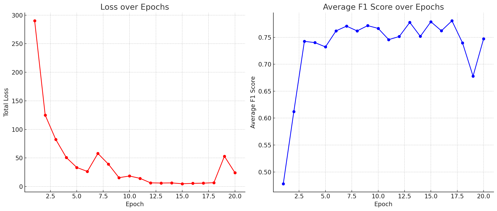
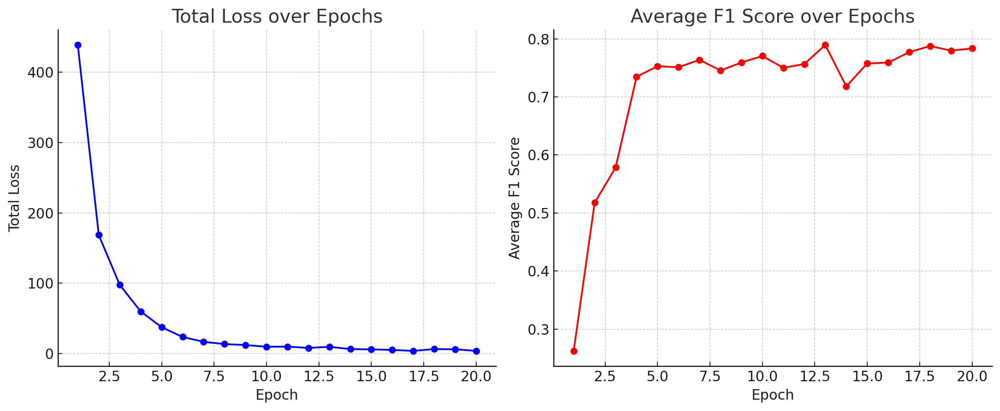

# Project Report: Personal Expense Classifier

## Evaluation Metrics and Targets

For evaluating our neural network model, we have selected the F1 score as our primary metric. Given the unbalanced nature of our dataset, we have chosen to use the average F1 score across all categories. This method provides a more balanced view of the model's performance, ensuring that even underrepresented categories significantly impact the overall evaluation.

### Targeted F1 Score

Our target for the model was set ambitiously high, aiming for an average F1 score of 90% or higher. This target was chosen to ensure a high level of accuracy and precision in expense classification, which is crucial for the effectiveness of the application in personal finance management.

## Time Spent on Project Tasks

In accordance with our work breakdown structure, the following is an estimated breakdown of the time spent on each phase of the project:

1. **Dataset Collection**: Approximately 8 hours spent gathering, formatting, and preprocessing our personal expense data.
2. **Designing Neural Network**: About 16 hours dedicated to developing the Embedding-based text classification model.
3. **Training and Fine-Tuning**: Roughly 5 hours spent in training, evaluating, and fine-tuning the model.
4. **Building Labeling-Application**: An estimated 27 hours to develop a user-friendly application to label the bankstatements, served by a FastAPI with my model to provide predictions.
5. **Testing and CI/CD**: To automatically test the application (preprocessing, training and backend) on push, an estimated 12 hours of work were invested. This took longer than expected due to a bug in VSCode.
6. **Documenting**: To write this report and document the results, approximatly 4h were spent.

These times are approximate and reflect the intensive effort and dedication invested in each phase of the project.

## Streamlit Frontend for Labeling

To facilitate the labeling process, a small frontend was developed using Streamlit. This tool was designed to expedite the laborious task of labeling bank statements. After the initial labeling of 100 statements, a preliminary model was trained and served using our backend. The frontend then pulled predictions from this model, pre-filling annotations for subsequent labeling. This allowed for a more efficient process, where only incorrect predictions required correction, and correct ones simply needed approval. This iterative approach not only streamlined the labeling task but also ensured continuous improvement of the model through active learning.

This additional step, while time-consuming, was pivotal in creating a more accurate dataset. It also allowed for the early implementation of a rudimentary training and serving process, which was instrumental in the project's iterative development approach.

## Classifier Implementation

Our classifier leverages a multilingual embedding model, specifically chosen for its proficiency in German among other languages. This was a crucial selection, as most popular embedding models lack extensive pre-training in German. We sourced our model from Hugging Face, a platform renowned for its extensive repository of pre-trained models and ease of implementation. The tokenizer, essential for preparing our textual data for the neural network, was also acquired from Hugging Face.

For the classification task, we designed a two-layer, fully connected Multi-Layer Perceptron (MLP) with Rectified Linear Unit (ReLU) activation and dropout. The choice of ReLU as the activation function was driven by its efficiency and effectiveness in non-linear transformations, which are essential in text classification tasks. ReLU helps in overcoming the vanishing gradient problem, common in deep neural networks, thereby facilitating faster and more effective training. Additionally, its simplicity leads to reduced computational complexity.

We incorporated dropout in our network architecture as a form of regularization. Dropout randomly deactivates a fraction of neurons during the training process, which helps in preventing overfitting. This technique is particularly beneficial in scenarios like ours, where the model complexity is high, and the risk of memorizing the training data is significant.

The training of our MLP was governed by the cross-entropy loss function. This choice was strategic for our multi-class classification task, as cross-entropy loss measures the performance of a classification model whose output is a probability value between 0 and 1. It provides a robust mechanism to quantify the difference between the predicted probabilities and the actual class, making it ideal for scenarios where precision in probability distribution is crucial.

Overall, the combination of a multilingual embedding model, ReLU activation, dropout regularization, and the cross-entropy loss function forms the backbone of our classifier, enabling it to effectively categorize personal expenses in a nuanced and accurate manner.

### Exploring different Models

In our project, we have developed two distinct models for classifying personal expenses, each leveraging unique approaches.

In our classification models, the handling of the 'amount' feature significantly differentiates Model 1 from Model 2. In Model 1, the 'amount' is treated as a part of the textual input, where it is concatenated with 'time' and 'description' into a single string before being processed by the embedding layer. This approach treats the 'amount' as an integral part of the overall textual context, embedding it in the same dimensional space as other textual elements. However, this method may not fully exploit the quantitative nature of the 'amount', as it is embedded alongside textual data, potentially diluting its distinct numerical characteristics.

Model 2, on the other hand, adopts a more nuanced approach to handling the 'amount'. In this model, the 'amount' is first normalized using the mean and standard deviation of the dataset, converting it into a standardized form. This normalized 'amount' is then appended to the output of the text-embedding layer, allowing the model to process it as a distinct numerical feature alongside the embedded textual data. By doing so, Model 2 directly incorporates the quantitative nature of the 'amount' into the network's decision-making process, potentially enhancing the model's ability to discern patterns related to financial values. This separate treatment of the 'amount' as a numerical feature could provide Model 2 with a more refined understanding of the relationship between financial amounts and the classification task.

## Training

In the model training process, our dataset was bifurcated into two distinct subsets. The first subset, referred to as the training set, is primarily utilized for the iterative adjustment of the model's weights. In contrast, the second subset, known as the validation set, serves a critical role in evaluating the model's efficacy on data it has not previously encountered. To prevent data leakage, which can bias the model, we calculated the mean and standard deviation of amounts only from the training set. These statistics were then applied to standardize the validation set. This approach aims to provide the most accurate estimation of the model's performance on unseen data.

The following two figures display the loss and average f1-score the models displayed during a training run.

One training run of model 1:


One training run of model2:


Both models display a really fast convergence and seem fit quite nice to the data. A steady average F1 score suggests that the model is not yet overfitting and seems to generalise quite well to the validation data.

### Results

Here are the results for training Model 1 for 20 epochs.

```txt
                                      precision    recall  f1-score   support

                      Food/Groceries       1.00      0.95      0.98       176
                          Food/Other       1.00      0.00      0.00         1
                    Food/Restaurants       0.84      0.96      0.89        71
                      Health/Medical       1.00      1.00      1.00         0
                        Health/Other       1.00      1.00      1.00         0
                     Health/Pharmacy       1.00      1.00      1.00         2
                   Housing/Furniture       0.50      0.75      0.60         4
                       Housing/Other       1.00      1.00      1.00         0
                        Housing/Rent       1.00      1.00      1.00         5
                   Housing/Utilities       1.00      1.00      1.00        16
                        Income/Other       0.97      0.94      0.95        31
                       Income/Refund       0.87      0.87      0.87        15
                       Income/Salary       1.00      1.00      1.00         2
                      Lifestyle/Cash       1.00      1.00      1.00        13
             Lifestyle/Entertainment       0.47      0.75      0.58        12
                     Lifestyle/Other       0.90      0.82      0.86        11
                          Other/Fees       1.00      1.00      1.00         9
                         Other/Other       1.00      0.20      0.33         5
                   Shopping/Clothing       0.43      0.60      0.50         5
                Shopping/Electronics       0.50      0.50      0.50         4
                      Shopping/Gifts       1.00      0.40      0.57         5
                      Shopping/Other       0.85      0.81      0.83        21
                     Sport/Equipment       0.75      0.75      0.75         4
                         Sport/Other       1.00      1.00      1.00         1
                         Sport/Sport       0.95      0.95      0.95        19
                Transportation/Other       1.00      1.00      1.00         1
Transportation/Public Transportation       1.00      0.96      0.98        56
                 Transportation/Taxi       1.00      1.00      1.00         2
                        Travel/Hotel       0.67      0.80      0.73         5
                        Travel/Other       0.67      0.40      0.50         5
                      Travel/Transit       0.50      0.67      0.57         3

                           micro avg       0.91      0.91      0.91       504
                           macro avg       0.87      0.81      0.80       504
                        weighted avg       0.92      0.91      0.91       504

```

And similarly for Model2:

```txt
                                      precision    recall  f1-score   support

                      Food/Groceries       0.99      0.96      0.97       176
                          Food/Other       1.00      0.00      0.00         1
                    Food/Restaurants       0.85      0.93      0.89        71
                      Health/Medical       1.00      1.00      1.00         0
                        Health/Other       1.00      1.00      1.00         0
                     Health/Pharmacy       1.00      1.00      1.00         2
                   Housing/Furniture       0.40      0.50      0.44         4
                       Housing/Other       1.00      1.00      1.00         0
                        Housing/Rent       1.00      1.00      1.00         5
                   Housing/Utilities       1.00      1.00      1.00        16
                        Income/Other       1.00      0.90      0.95        31
                       Income/Refund       0.65      1.00      0.79        15
                       Income/Salary       1.00      1.00      1.00         2
                      Lifestyle/Cash       1.00      1.00      1.00        13
             Lifestyle/Entertainment       0.50      0.75      0.60        12
                     Lifestyle/Other       0.67      0.91      0.77        11
                          Other/Fees       1.00      1.00      1.00         9
                         Other/Other       0.25      0.20      0.22         5
                   Shopping/Clothing       0.75      0.60      0.67         5
                Shopping/Electronics       0.50      0.25      0.33         4
                      Shopping/Gifts       0.67      0.40      0.50         5
                      Shopping/Other       0.94      0.76      0.84        21
                     Sport/Equipment       0.75      0.75      0.75         4
                         Sport/Other       1.00      1.00      1.00         1
                         Sport/Sport       0.90      0.95      0.92        19
                Transportation/Other       1.00      1.00      1.00         1
Transportation/Public Transportation       1.00      0.95      0.97        56
                 Transportation/Taxi       1.00      1.00      1.00         2
                        Travel/Hotel       0.67      0.80      0.73         5
                        Travel/Other       1.00      0.40      0.57         5
                      Travel/Transit       1.00      0.00      0.00         3

                           micro avg       0.90      0.90      0.90       504
                           macro avg       0.85      0.77      0.77       504
                        weighted avg       0.91      0.90      0.90       504
```

Both models exhibit closely aligned performance, with only marginal differences in their results. This could be attributed to the randomness inherent in the initialization process of neural networks. The striking similarity in their performance suggests that the architectural differences between the two models have a relatively minor impact on their overall effectiveness in classifying personal expenses.

Furthermore, the macro-average F1 score, which reflects the average F1 score across all categories, hovers around 0.8 for both models – 0.81 for Model 1 and 0.77 for Model 2. Although this falls short of the 90% target I had set for these models, it's important to consider the context provided by the 'support' column in the results. This column reveals that both models perform exceptionally well in frequently occurring categories but face challenges in accurately classifying categories that appear infrequently. This pattern suggests that the models are highly capable in handling common expense types but may require further refinement or additional data to improve their performance in less common categories.

## Unit Testing and CI/CD Using Github

Unit testing was a critical component of our development process, ensuring the robustness of various parts of our application. We implemented tests for:

- **Pre-processing Checks**: To validate the correct functioning of our data pre-processing steps.
- **Backend Functionality**: Using FastAPI, we tested the REST endpoint functionality.
- **Training Process Validation**: A small script was created to test the training process on a sample dataset, ensuring no errors during actual training.

These tests were integrated into our workflow using GitHub Actions, which automatically ran on every push to our repository. This continuous integration approach allowed us to maintain high code quality and quickly identify and fix any issues.
